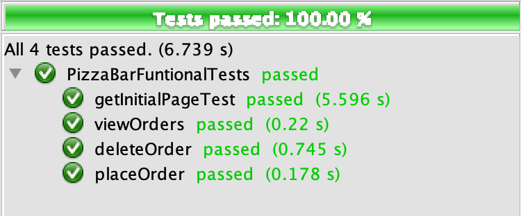

# MarioPizzaBar-Selenium 

This repository contains a setup for automated UI tests with Selinium. The tests are made based on a static HTML Web user interface which can be fired up by the commands in the following section:

## How to run
1. Execute `docker run -d --rm -p 3000:80 elit0452/mario_pizza_bar:selenium` command
	-  In case you don't have the image downloaded, it will be downloaded from Docker hub 🐳. 

1. The Web user interface will be accessible through `localhost:3000`

1. Clone the project using the  following command **or** download the repository zip file
`git clone https://github.com/elit0451/MarioPizzaBar-Selenium.git`

1. Open the solution into an IDE for Java and run the [_PizzaBarFuntionalTests.java_](https://github.com/elit0451/MarioPizzaBar-Selenium/blob/master/src/test/java/PizzaBarFuntionalTests.java) test file

## Test results

 

___
> #### Assignment made by:   
`David Alves 👨🏻‍💻 ` :octocat: [Github](https://github.com/davi7725)  
`Elitsa Marinovska 👩🏻‍💻 ` :octocat: [Github](https://github.com/elit0451)  
> Attending "Tests" course of Software Development bachelor's degree
